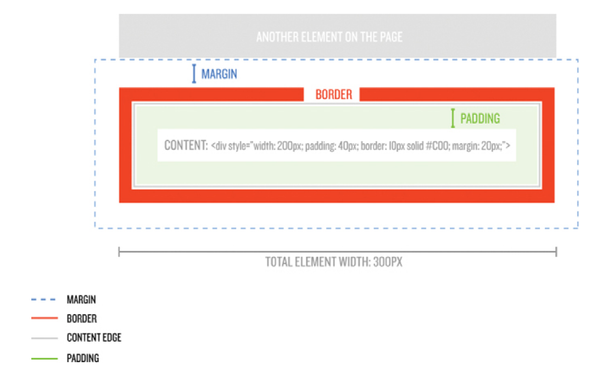
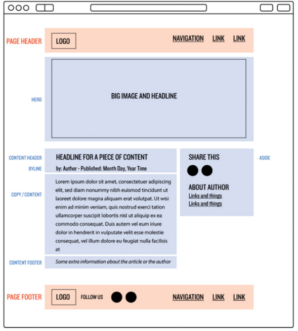

# Front end path

## Git 

### Instalacion

#### Mac

1. Se instala Homebrew [click aquí](https://brew.sh/)

- Abrir el terminal de macOS
- Pegar el siguiente comando en el terminal:

```
/bin/bash -c "$(curl -fsSL https://raw.githubusercontent.com/Homebrew/install/HEAD/install.sh)"
```

2. Se instala Git

- Luego de haber instalado Homebrew pegamos en la consola el siguiente comando:

```
brew install git
```
#### Ubuntu

 ##### Pasos para instalar Git en sistema operativo Ubuntu.

- **1.** Desde tu consola , instala Git mediante los siguientes comandos:

```shell
sudo apt-get update
sudo apt-get install git
```
- **2.** Escribe **git --version** para verificar la versión y que esta se haya instalado correctamente.

Debe salirte la version de git instalada. ejemplo de salida: **git version 2.9.2**


### Configuracion

1. Copiar y pegar en tu terminal editando tu username e email:

```shell
 git config --global core.editor "vim"
 git config --global push.default upstream
 git config --global merge.conflictstyle diff3
 git config --global user.name <tu_username>
 git config --global user.email <tu-email>
 git config --global push.default current
```

2. Chequear datos con el siguiente comando:
```shell
git config --list
```

### Comandos

- **git init:**
- **git add:** añade cambios de archivos en tu directorio. En el siguiente ejemplo se añaden todos los cambios realizados:

```shell
git add
```
- **git commit:** toma todos los cambios escritos en el index, crea un nuevo objeto de confirmación que apunta a él y establece la rama para que apunte a esa nueva confirmación. Ejemplo:

```shell
git commit -m "Comprometer cambios añadidos"
```
*El comentario que se haga se sugiere hacerlo como un mandato* 

- **git status:** te muestra el estado de los archivos en el index en comparación con los del directorio de trabajo.

```shell
git status
```
- **git pull:** Fusiona todos los cambios que se han hecho en el repositorio remoto con el directorio de trabajo local.

```shell
git pull <remoto> <local>
```
ejemplo:

```shell
git pull
git pull origin my-branch
```

Es el equivalente a un `fetch` y luego `merge`.

- **git grep:** Le permite al usuario buscar frases y palabras específicas en los árboles de confirmación, el directorio de trabajo y en el área de preparación.

- **git log:** Se usa para ver el historial del repositorio listando ciertos detalles de la confirmación. 
Algunas opciones que usamos son `--graph` y `--oneline`

- **git checkout -b <nombre de tu nueva rama>:** Crea una nueva rama, y a la vez te lleva a ella. Mismo resultado que usar git branch <nombre de tu nueva rama> y git checkout <nombre de tu nueva rama>, pero con un solo comando.

```shell
git checkout -b <nombre de tu nueva rama>
```

- **git merge:** Permite fusionar una rama con otra 

```shell
git merge <nombre de la rama con la que quieres fusionar>
```
- **git push:** Carga el contenido de nuestro repositorio local a nuestro repositorio remoto asociado.

```shell
git push
git push <remoto> <rama>
```

### Añadiendo ssh keys al ssh-agent

1. Comenzar el ssh-agent en segundo plano
```shell
eval "$(ssh-agent -s)"
```
2. Abrir el archivo ~/.ssh/config:
 ```shell
vim ~/.ssh/config
```

3. Para cada ssh key añada una entrada similar a esta:

```shell
Host github.com
  HostName github.com
  AddKeysToAgent yes
  UseKeychain yes
  IdentityFile ~/.ssh/github
```
4. Cambiar los permisos del archivo:

```shell
chmod  600 ~/.ssh/config
``` 
6. Por cada ssh key añadir al ssh-agent y almacenar su passphrase en la keychain ejemplo:

```shell
ssh-add --apple-use-keychain  ~/.ssh/github
```


## Recursos y referencias

### Git

 - [Tutorial interactivo](https://learngitbranching.js.org/)
### videos

- [Lista de reproducción](https://www.youtube.com/playlist?list=PLa9mLndWyHK3Fuqsc1JE9nDH31wBq4BRt)

### Markdown

- [chuleta](https://www.markdownguide.org/cheat-sheet/)

## HTML

As the name HyperText Markup Language indicates, HTML is a markup
language, which allows a web author to organize and define how content
should be displayed. This means HTML can do things like add text formatting;
make headings, lists, and tables; and include images and links.

HTML source is plain text, which makes it ideal for editing with a text editor
(as discussed in Learn Enough Text Editor to Be Dangerous). Instead of using
the convenient but inflexible What You See Is What You Get (WYSIWYG)
approach of word processors, HTML indicates formatting using special tags
which are the text annotations alluded to above.
As we’ll see, HTML supports more than one kind of tags, but the most
common kind consist of strings (sequences of characters) enclosed in
beginning and ending tags, like this:

```html
<strong>make them strong</strong>, but this one is outside
```
### History

|     Year              |	   Version            |
| -------------         |:-----------------------:|
|1989|	Tim Berners-Lee invented www              |
|1991|	Tim Berners-Lee invented HTML             |
|1993|	Dave Raggett drafted HTML+ .              |
|1995|	HTML Working Group defined HTML 2.0       |
|1997|	W3C Recommendation: HTML 3.2 .            |
|1999|	W3C Recommendation: HTML 4.01             |
|2000|	W3C Recommendation: XHTML 1.0             |
|2008|	WHATWG HTML5 First Public Draft           |
|2012|	WHATWG HTML5 Living Standard              |
|2014|	W3C Recommendation: HTML5                 |
|2016|	W3C Candidate Recommendation: HTML 5.1    |
|2017|	W3C Recommendation: HTML5.1 2nd Edition   |
|2017|	W3C Recommendation: HTML5.2               |

# Tags y notas

```
<html>	Defines the root of an HTML document
<body>	Defines the document's body
<h1> to <h6>	Defines HTML headings
<p>	Defines a paragraph
<hr>	Defines a thematic change in the content
<br>	Inserts a single line break
<pre>	Defines pre-formatted text

- All HTML elements can have attributes
- The href attribute of <a> specifies the URL of the page the link goes to
- The src attribute of  specifies the path to the image to be displayed
- The width and height attributes of  provide size information for images
- The alt attribute of  provides an alternate text for an image
- The style attribute is used to add styles to an element, such as color, font, size, and more
- The lang attribute of the <html> tag declares the language of the Web page
- The title attribute defines some extra information about an element
```

### CSS


#### Notas

- borders (a line
around the box), margins (the distance away from other boxes), and padding
(empty space inside the box separating content from the border).

- Elements that are considered inline elements, like span or a, are only allowed to
have margins and padding applied to the left and right (not top or bottom), and
they won’t accept a width or height set by CSS. None of these restrictions
apply to block elements.

<p align="center">
  
</p>

- To check if some fonts are available in you SO please take a look https://www.cssfontstack.com/

### Layout "standard"
<p align="center">
  
</p>


## Glosario

- **Comando whoami**: es un comando del tipo Unix, proviene de la concatenación de las palabras en inglés ¿Who am I? que significa, ¿Quién soy?. Es un comando simple, utilizado para imprimir el nombre de usuario efectivo del usuario actual cuando se invoca, que se entiende como el nombre del usuario en sesión.

- **HTTP**: significa Hyper Text Transfer Protocol (Protocolo de Transferencia de Hipertexto). Es el protocolo utilizado por tus dispositivos para comunicarse con las páginas web, pero no se encuentra protegido de forma segura.
- **SSH**: es un programa que permite acceder a otro ordenador a través de la red, ejecutar comandos en la máquina remota y mover ficheros entre dos.
- **¿Qué es el comando `ls`?**: Este comando nos permite listar un directorio determinado con todo su contenido. Al poner el comando ls nos mostrará todos los archivos y carpetas que existen dentro del directorio en el que nos encontramos.

- **Permisos UNIX-LINUX**: En los Sistemas Unix, la gestión de los permisos que los usuarios y los grupos de usuarios tienen sobre los archivos y las carpetas, se realiza mediante un sencillo esquema de tres tipos de permisos que son:


  - permiso de lectura **( r ) read**
  - permiso de escritura **(w) write**
  - permiso de ejecución **(x) execute**

- **¿Que es un usuario root?**: Es una cuenta de usuario especial que no pertenece a ningún grupo de acceso, el usuario root puede visualizar, editar o utilizar cualquier objeto de datos en el sistema. 

> **Note**
> El usuario root es siempre un usuario de altos privilegios.

- **¿Que es markdown?**
Es una forma sencilla de agregar formato a textos en la web y funciona incorporando algunos caracteres a nuestro contenido.

- **Bash y Zsh** 
Bash (acrónimo de Bourne-Again Shell) es un intérprete de comandos y lenguaje de programación integrado que corre bajo el macroprocesador Shell de Unix. Este programa ejecuta una a una las órdenes que el usuario pone en una ventana de texto o las que se encuentran contenidas en un script o bash script (archivo con todas las instrucciones), para luego devolver los resultados.
ZSH, también llamado Z shell, es una versión extendida de Bourne Shell (sh), con muchas características nuevas y soporte para plugins y temas. Dado que se basa en el mismo shell que Bash, ZSH tiene muchas de las mismas características. 

- **Comando cd** 
cd = change directory
Este comando te ayuda a moverte o posicionarte dentro de los directorios (folders). Que es lo mismo que buscar folders dentro de Finder 

- **Comando mkdir** 

mkdir = crea un directorio
Al escribir este comando crearás un directorio ó folder.
```shell
mkdir <nombre-directorio>
```

Crea un directorio y en caso de que los directorios
padres no existan tambien los crea:

```shell
mkdir -p <folder_p1>/<folder_p2>/<folder_p3>/<folder>
```

## Herramientas

- Edicion de imagenes gratuita https://evernote.com/products/skitch


## Jekyll


### Dependencias

#### Ruby/RVM

1. intalacion

```shell
\curl -sSL https://get.rvm.io | bash
```

para testear la instalacion corre este comando en una nueva terminal

```shell
type rvm | head -n 1
```

la salida debe ser algo igual a

 ```
 rvm is a function
 ```
o

```
rvm is a shell function from <your-path>
```

- en caso que la salida sea diferente anexar estas lineas `.zshrc` (mac default) or `.bashrc` (bash shell) 

```
# Add RVM to PATH for scripting. Make sure this is the last PATH variable change.
export PATH="$PATH:$HOME/.rvm/bin"
export PATH="$GEM_HOME/bin:$PATH"
[[ -s "$HOME/.rvm/scripts/rvm" ]] && source "$HOME/.rvm/scripts/rvm"
```

si deseas actualizarlo 

```shell
rvm get stable    # last rvm stable version
rvm get head      # last rvm version(may be no stable)
```

Instalar versiones de ruby 

```shell
rvm list known		 	         # list ruby versions 
rvm install <version_ruby> 	 # install a specific version
rvm list    						     # list installed versions
rvm uninstall <version_ruby> # uninstall version withouth remove doc
rvm remove    <version_ruby> # uninstall version removing doc
```
establecer la version del sistema operativo por default
```
rvm --default use 3.2.2 
```

listar gemsets:

```shell
rvm gemset list
```

```shell
rvm --create --ruby-version use <version_ruby>@<gemset_name>
```

### Instalacion 

- Instalar openssl usando este comando (solo para Mac):   
```shell
brew install openssl@3
```

- Instalar las dependencias con:
```shell
 bundle _2.2.17_ install
```

### Verificar que funciona

- Moverse a sample_website:  
```shell
cd sample_website
```
- Correr jekyll: 
```shell
 bundle _2.2.17_ exec jekyll serve  
```
- copiar en el navegador: http://127.0.0.1:4000/

- Para salir de jekyll server presiona Ctrl + c
# TODO.
- configurar consola
- configurar rvm autocomplete
- crear un ambiente remoto en aws