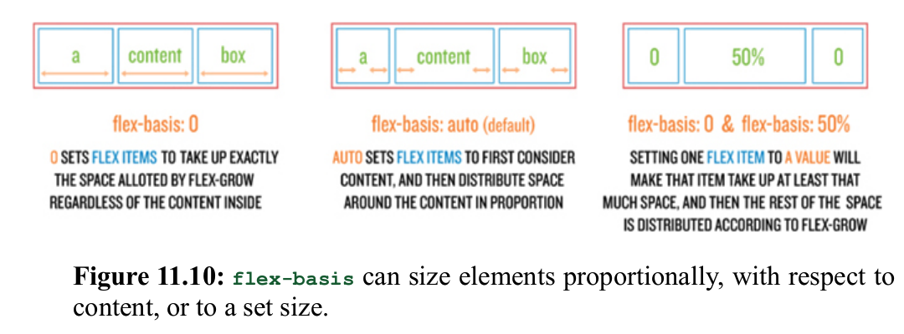
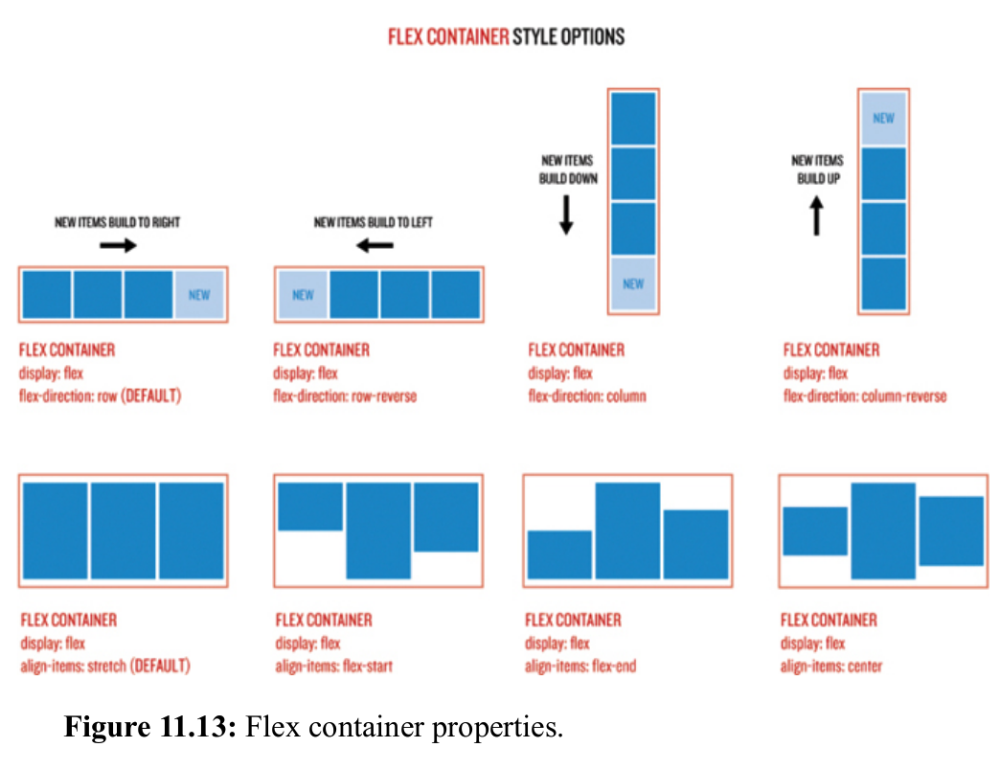

# Front end path

## Visual Studio Code

Para instalar el editor de codigo ve a [VsCode](https://code.visualstudio.com/?wt.mc_id=vscom_downloads)

### Plugins

- [EditorConfig](https://marketplace.visualstudio.com/items?itemName=EditorConfig.EditorConfig):
  Para tener una experiencia uniforme entre editores se usa .editorconfig

- [Gitlens](https://marketplace.visualstudio.com/items?itemName=eamodio.gitlens):
  Extension para git en vscode

- [LiveShare](https://marketplace.visualstudio.com/items?itemName=MS-vsliveshare.vsliveshare):
  Para trabajar en equipo [Markdown Preview Enhanced](https://marketplace.visualstudio.com/items?itemName=shd101wyy.markdown-preview-enhanced):

- Para previsualizar markdown [Vim
  emulator](https://marketplace.visualstudio.com/items?itemName=vscodevim.vim):
  emular vim en vscode, este ultimo es opcional porque puede ser dificil de
  usar, para aprender mas movimientos vim vea [este link](https://vim.rtorr.com/)

- [Prettier - Code formatter](https://marketplace.visualstudio.com/items?itemName=esbenp.prettier-vscode)
  Para dar formato a nuestros archivos
  para establecerlo como default presione `ctrl+shift+p` o `cmd+shift+p`(mac)
  busque `Preferences: Open User Settings (Json)` y añada al final pero dentro de
  la llave:

  ```json
      "editor.defaultFormatter": "esbenp.prettier-vscode",
      "[javascript]": {
      "editor.defaultFormatter": "esbenp.prettier-vscode"
      },
  ```

recuerde que la linea previa debe terminar con coma, porque en json cada
elemento esta separado por comas.

## Git

### Instalacion

#### Mac

1. Se instala Homebrew [click aquí](https://brew.sh/)

- Abrir el terminal de macOS
- Pegar el siguiente comando en el terminal:

```
/bin/bash -c "$(curl -fsSL https://raw.githubusercontent.com/Homebrew/install/HEAD/install.sh)"
```

2. Se instala Git

- Luego de haber instalado Homebrew pegamos en la consola el siguiente comando:

```
brew install git
```

#### Ubuntu

##### Pasos para instalar Git en sistema operativo Ubuntu.

- **1.** Desde tu consola , instala Git mediante los siguientes comandos:

```shell
sudo apt-get update
sudo apt-get install git
```

- **2.** Escribe **git --version** para verificar la versión y que esta se haya instalado correctamente.

Debe salirte la version de git instalada. ejemplo de salida: **git version 2.9.2**

### Configuracion

1. Copiar y pegar en tu terminal editando tu username e email:

```shell
 git config --global core.editor "vim"
 git config --global push.default upstream
 git config --global merge.conflictstyle diff3
 git config --global user.name <tu_username>
 git config --global user.email <tu-email>
 git config --global push.default current
```

2. Chequear datos con el siguiente comando:

```shell
git config --list
```

### Comandos

- **git init:**
- **git add:** añade cambios de archivos en tu directorio. En el siguiente ejemplo se añaden todos los cambios realizados:

```shell
git add
```

- **git commit:** toma todos los cambios escritos en el index, crea un nuevo
  objeto de confirmación que apunta a él y establece la rama para que apunte a
  esa nueva confirmación. Ejemplo:

```shell
git commit -m "Comprometer cambios añadidos"
```

_El comentario que se haga se sugiere hacerlo como un mandato_

- **git status:** te muestra el estado de los archivos en el index en comparación con los del directorio de trabajo.

```shell
git status
```

- **git pull:** Fusiona todos los cambios que se han hecho en el repositorio remoto con el directorio de trabajo local.

```shell
git pull <remoto> <local>
```

ejemplo:

```shell
git pull
git pull origin my-branch
```

Es el equivalente a un `fetch` y luego `merge`.

- **git grep:** Le permite al usuario buscar frases y palabras específicas en
  los árboles de confirmación, el directorio de trabajo y en el área de
  preparación.

- **git log:** Se usa para ver el historial del repositorio listando ciertos
  detalles de la confirmación.
  Algunas opciones que usamos son `--graph` y `--oneline`

- **git checkout -b <nombre de tu nueva rama>:** Crea una nueva rama, y a la vez
  te lleva a ella. Mismo resultado que usar git branch <nombre de tu nueva rama>
  y git checkout <nombre de tu nueva rama>, pero con un solo comando.

```shell
git checkout -b <nombre de tu nueva rama>
```

- **git merge:** Permite fusionar una rama con otra

```shell
git merge <nombre de la rama con la que quieres fusionar>
```

- **git push:** Carga el contenido de nuestro repositorio local a nuestro
  repositorio remoto asociado.

```shell
git push
git push <remoto> <rama>
```

- **git remote:** para el manejo de remotos como por ejemplo github

```shell
git remote prune origin  # limpiar local removiendo
                         # lo que NO esta en remoto llamado "origin"
```

### Añadiendo ssh keys al ssh-agent

1. Comenzar el ssh-agent en segundo plano

   ```shell
   eval "$(ssh-agent -s)"
   ```

2. Abrir el archivo ~/.ssh/config:

   ```shell
   vim ~/.ssh/config
   ```

3. Para cada ssh key añada una entrada similar a esta:

   ```shell
   Host github.com
     HostName github.com
     AddKeysToAgent yes
     UseKeychain yes
     IdentityFile ~/.ssh/github
   ```

4. Cambiar los permisos del archivo:

   ```shell
   chmod  600 ~/.ssh/config
   ```

5. Por cada ssh key añadir al ssh-agent y almacenar su passphrase en la keychain ejemplo:

   ```shell
   ssh-add --apple-use-keychain  ~/.ssh/github
   ```

### Estrategias de mezclado

<p align="center">
  
</p>
<p align="center">
  
</p>
## Recursos y referencias

### Git

- [Tutorial interactivo](https://learngitbranching.js.org/)
- [Rebase vs merge](https://www.atlassian.com/git/tutorials/merging-vs-rebasing)
- [Long running branches](https://westonal.medium.com/long-running-branches-8925a13001ef)

### videos

- [Lista de reproducción](https://www.youtube.com/playlist?list=PLa9mLndWyHK3Fuqsc1JE9nDH31wBq4BRt)

### Markdown

- [chuleta](https://www.markdownguide.org/cheat-sheet/)

## HTML

As the name HyperText Markup Language indicates, HTML is a markup
language, which allows a web author to organize and define how content
should be displayed. This means HTML can do things like add text formatting;
make headings, lists, and tables; and include images and links.

HTML source is plain text, which makes it ideal for editing with a text editor
(as discussed in Learn Enough Text Editor to Be Dangerous). Instead of using
the convenient but inflexible What You See Is What You Get (WYSIWYG)
approach of word processors, HTML indicates formatting using special tags
which are the text annotations alluded to above.
As we’ll see, HTML supports more than one kind of tags, but the most
common kind consist of strings (sequences of characters) enclosed in
beginning and ending tags, like this:

```html
<strong>make them strong</strong>, but this one is outside
```

### History

| Year |                 Version                 |
| ---- | :-------------------------------------: |
| 1989 |      Tim Berners-Lee invented www       |
| 1991 |      Tim Berners-Lee invented HTML      |
| 1993 |      Dave Raggett drafted HTML+ .       |
| 1995 |   HTML Working Group defined HTML 2.0   |
| 1997 |     W3C Recommendation: HTML 3.2 .      |
| 1999 |      W3C Recommendation: HTML 4.01      |
| 2000 |      W3C Recommendation: XHTML 1.0      |
| 2008 |     WHATWG HTML5 First Public Draft     |
| 2012 |      WHATWG HTML5 Living Standard       |
| 2014 |        W3C Recommendation: HTML5        |
| 2016 | W3C Candidate Recommendation: HTML 5.1  |
| 2017 | W3C Recommendation: HTML5.1 2nd Edition |
| 2017 |       W3C Recommendation: HTML5.2       |

# Tags y notas

```
<html>	Defines the root of an HTML document
<body>	Defines the document's body
<h1> to <h6>	Defines HTML headings
<p>	Defines a paragraph
<hr>	Defines a thematic change in the content
<br>	Inserts a single line break
<pre>	Defines pre-formatted text

- All HTML elements can have attributes
- The href attribute of <a> specifies the URL of the page the link goes to
- The src attribute of  specifies the path to the image to be displayed
- The width and height attributes of  provide size information for images
- The alt attribute of  provides an alternate text for an image
- The style attribute is used to add styles to an element, such as color, font, size, and more
- The lang attribute of the <html> tag declares the language of the Web page
- The title attribute defines some extra information about an element
```

### CSS

#### Notas

- borders (a line around the box), margins (the distance away from other boxes), and padding (empty space inside the box separating content from the border).

- Elements that are considered inline elements, like span or a, are only allowed to
  have margins and padding applied to the left and right (not top or bottom), and
  they won’t accept a width or height set by CSS. None of these restrictions
  apply to block elements.

<p align="center">
  
</p>

- To check if some fonts are available in you SO please take a look https://www.cssfontstack.com/

#### Layout "standard"

<p align="center">
  
</p>

#### Posicionamiento

- Absoluto(absolute):

<p align="center">
  
</p>

- Relativo(relative)

<p align="center">
  
</p>

- Fijo(fix)

<p align="center">
  
</p>

nota: La forma en que la posición se basa fuera de los límites de la parent es a
lo que nos referimos cuando dijimos que establecer una envoltura principal en
`position: relative` lo hizo como un lienzo separado: todo lo que está dentro de
una posición absoluta toma su lugar en función de las dimensiones del padre.

#### Flexbox

- **flex-grow** determines how flex items grow inside their parent. Default 0.
- **flex-shrink** determines how flex items shrink when their parent gets smaller.
  Default 1.
- **flex-basis** determines the size of flex items before space is distributed and
  how content is treated. Default auto.

Short hand:

```css
flex: <flex-grow> <flex-shrink> <flex-basis>;
```

<p align="center">
  
</p>

<p align="center">
  
</p>

<p align="center">
  
</p>

<p align="center">
  
</p>

<p align="center">
  
</p>
#### links y Recursos

- https://www.cssmatic.com/
- [caracteres Unicode](https://symbl.cc/en/)

### JavaScript

JavaScript was originally developed by computer scientist Brendan Eich for
Netscape Navigator, the first commercial web browser, under the name
“LiveScript”.

Later on, a standardized version of JavaScript called ECMAScript
(pronounced ECK-muh-script) was created in an effort to improve
cross-browser compatibility.

The main exception to this rule is our
occasional use of contracted names like “ES6”, which refers to the
sixth edition of ECMAScript.

### Array

Los arrays son objetos similares a una lista cuyo prototipo proporciona métodos para efectuar operaciones de recorrido y de mutación. Tanto la longitud como el tipo de los elementos de un array son variables.

#### Declaracion

```javascript
a = [42, 8, 17, 99];
```

#### Metodos

1. slice:
   El propósito de este método es, como su nombre indica, cortar un trozo del array. Es decir que con slice podemos definir una sección del array que queremos mantener, eliminando los elementos restantes. _Ejemplo:_

```javascript
a.slice(1);
console.log(a); // [8, 17, 99]
```

2. lenght:
   Length es la propiedad de una función objeto, e indica el número de argumentos que una función requiere, por ejemplo, el número de parámetros formales. _Ejemplo:_

```javascript
a.length;
console.log(a); // 4
```

3. includes:
   Este método determina si una matriz incluye un determinado elemento, devuelve true o false según corresponda. _Ejemplo:_

```javascript
a.includes(1);
console.log(a); // false debido a que el numero 1 no es un elemento del array

a.includes(42);
console.log(a); // true
```

4. reverse:
   Invierte el orden de los elementos de un array. El primer elemento pasa a ser
   el último y el último pasa a ser el primero. Cabe mencionar que este metodo
   modifica el array original. _Ejemplo:_

```javascript
a.reverse(); // [99, 17, 8, 42]

console.log(a); // [99, 17, 8, 42]
```

5. sort:
   Ordenará los números en función de su valor como cadena de texto, no de su valor numérico. _Ejemplo:_

```javascript
a.sort(); // [17, 42, 8, 99]

console.log(a); // [17, 42, 8, 99]
```

**Nota: como en el ejemplo anterior, este metodo tambien modifica el array original**

Para personalizar cómo `sort()` ordena los elementos, puedes pasar una función de comparación como argumento. La función de comparación debe devolver:

- Un valor negativo si el primer argumento debe aparecer antes que el segundo.
  En nuestro caso esta función de comparación ordena los número de mayor a
  menor. _Ejemplo:_

```javascript
a.sort(function (a, b) {
 return b - a;
});
console.log(a); // [99, 42, 17, 8]
```

- Un valor positivo si el segundo argumento debe aparecer antes que el primero.
  En nuestro caso esta función de comparación ordena los número de menor a
  mayor. _Ejemplo:_

```javascript
a.sort(function (a, b) {
 return a - b;
});
console.log(a); // [8, 17, 42, 99]
```

- Cero si ambos argumentos son iguales.

6. toSorted()

Como se observó en el ejempllo anterior `.sort() `modifica el array
original. Si se quiere obtener un array ordenado sin modificar el original, se
puede usar el método `.toSorted()`. _Ejemplo:_

```javascript
let numerosOrdenados = a.toSorted((a, b) => {
 return a - b;
});
console.log(numerosOrdenados); // [8, 17, 42, 99]
```

7. push:

El método push() agrega los elementos especificados al final de un array y
devuelve la nueva longitud del array. Afecta el original. _Ejemplo:_

```javascript
a = [42, 8, 17, 99];
a.push(12);
// a -> [42, 8, 17, 99, 12];
```

8. pop:
   El método pop() elimina el último elemento de un array y devuelve ese elemento.
   Este método cambia la longitud del array. Afecta el original. _Ejemplo:_

```javascript
a = [42, 8, 17, 99];
a.pop();
//a -> [42, 8, 17];
```

9. join:

El método join() crea y devuelve un nuevo string concatenando todos los
elementos en el array, separados por comas o una cadena de separación
especificada. Si el array tiene solo un elemento, ese elemento se devolverá sin
usar el separador. _Ejemplo:_

```javascript
a = ["ant", "bat", "cat", "42"];
a.join(", ");
//a -> 'ant, bat, cat, 42';
```

10. shift:

El método shift() elimina el primer elemento de un array y devuelve ese elemento
eliminado. Este método cambia la longitud del array. Afecta el original.

_Ejemplo:_

```javascript
a = [42, 8, 17, 99];
a.shift();
// a -> [8, 17, 99];
```

11. unshift:

El método unshift() agrega los elementos especificados al comienzo de un array y
devuelve la nueva longitud del array. Afecta el original. _Ejemplo:_

```javascript
a = [42, 8, 17, 99];
a.unshift(51);
a -> [51, 42, 8, 17, 99];
```

12. from:

```javascript
Array.from("honey badger");
//[ 'h', 'o', 'n', 'e', 'y', ' ', 'b', 'a', 'd', 'g', 'e', 'r' ]
```

#### Regex

1. Usando `RegExp` object

```javascript
let zipCode = new RegExp("\\d{5}");
let result = zipCode.exec("Beverly Hills 90210");
result;
//[ '90210', index: 14, input: 'Beverly Hills 90210' ]
```

2. Usando metodos strings

````javascript
const zipCode = /\d{5}/;
//zipCode = /\d{5}/g; /*busquedas globales */
let s = "Beverly Hills 90210 was a '90s TV show set in Los Angeles.";
s += " 91125 is another ZIP code in the Los Angeles area.";
s.match(zipCode);
!!s.match(zipCode); /*verfica si hay coincidencia o no*/
```
#### Estructuras de repeticion

- for:
```javascript
for (let i = 0; i < array.length; i++) {
    console.log(array[i]);
}
```
- forEach:
```javascript
array.forEach(function(element){
    console.log(element);
    }
)
```
- for-of:

```javascript
for(element of array){
    console.log(element);
}
```
#### Objects

```javascript
let user = {"firstName": "Michael", "lastName": "Hartl" };
user["lastName"]
user.lastName  //esta notacion es equivalente a la linea anterior

testObject = new Object({ firstName: 'Michael', lastName: 'Hartl' });
````

#### Funciones

```javascript
function myAwesomeFunctionName(parameterList) {
    ...
}

let myAwesomeFunctionName = (parameterList) => {
    ...
}

myAwesomeFunctionName("myRealArguments")
```

#### Map

- Declaracion

```javascript
let uniques = new Map();
```

- comprobar existencia de key

```javascript
uniques.has(word);
```

- Establecer una nueva entrada en el map

```javascript
uniques.set(word, 1);
```

- Actualizar una nueva entrada en el map

```javascript
uniques.set(word, uniques.get(word) + 1);
```

#### map function

```javascript
[1, 2, 3, 4].map(function (n) {
 return n * n;
});

[1, 2, 3, 4].map((n) => {
 return n * n;
});

// prettier-ignore
[1, 2, 3, 4].map(n => n * n);
```

#### REPL

1. Cargar archivos

```javascript
.load nombre-del-archivo.js
```

#### Recursos

- [Documentacion MDF](https://developer.mozilla.org/en-US/docs/Web/JavaScript)
- [NPM](https://www.npmjs.com/)
- [Udemy course](https://www.udemy.com/course/react-the-complete-guide-incl-redux/learn/lecture/25595350?start=0#overview)

## Glosario

- **Comando whoami**: es un comando del tipo Unix, proviene de la concatenación de las palabras en inglés ¿Who am I? que significa, ¿Quién soy?. Es un comando simple, utilizado para imprimir el nombre de usuario efectivo del usuario actual cuando se invoca, que se entiende como el nombre del usuario en sesión.

- **HTTP**: significa Hyper Text Transfer Protocol (Protocolo de Transferencia de Hipertexto). Es el protocolo utilizado por tus dispositivos para comunicarse con las páginas web, pero no se encuentra protegido de forma segura.
- **SSH**: es un programa que permite acceder a otro ordenador a través de la red, ejecutar comandos en la máquina remota y mover ficheros entre dos.
- **¿Qué es el comando `ls`?**: Este comando nos permite listar un directorio determinado con todo su contenido. Al poner el comando ls nos mostrará todos los archivos y carpetas que existen dentro del directorio en el que nos encontramos.

- **Permisos UNIX-LINUX**: En los Sistemas Unix, la gestión de los permisos que los usuarios y los grupos de usuarios tienen sobre los archivos y las carpetas, se realiza mediante un sencillo esquema de tres tipos de permisos que son:

  - permiso de lectura **( r ) read**
  - permiso de escritura **(w) write**
  - permiso de ejecución **(x) execute**

- **¿Que es un usuario root?**: Es una cuenta de usuario especial que no pertenece a ningún grupo de acceso, el usuario root puede visualizar, editar o utilizar cualquier objeto de datos en el sistema.

> **Note**
> El usuario root es siempre un usuario de altos privilegios.

- **¿Que es markdown?**
  Es una forma sencilla de agregar formato a textos en la web y funciona incorporando algunos caracteres a nuestro contenido.

- **Bash y Zsh**
  Bash (acrónimo de Bourne-Again Shell) es un intérprete de comandos y lenguaje de programación integrado que corre bajo el macroprocesador Shell de Unix. Este programa ejecuta una a una las órdenes que el usuario pone en una ventana de texto o las que se encuentran contenidas en un script o bash script (archivo con todas las instrucciones), para luego devolver los resultados.
  ZSH, también llamado Z shell, es una versión extendida de Bourne Shell (sh), con muchas características nuevas y soporte para plugins y temas. Dado que se basa en el mismo shell que Bash, ZSH tiene muchas de las mismas características.

- **Comando cd**
  cd = change directory
  Este comando te ayuda a moverte o posicionarte dentro de los directorios (folders). Que es lo mismo que buscar folders dentro de Finder

- **Comando mkdir**

mkdir = crea un directorio
Al escribir este comando crearás un directorio ó folder.

```shell
mkdir <nombre-directorio>
```

Crea un directorio y en caso de que los directorios
padres no existan tambien los crea:

```shell
mkdir -p <folder_p1>/<folder_p2>/<folder_p3>/<folder>
```

## Herramientas

- Edicion de imagenes gratuita https://evernote.com/products/skitch

## Jekyll

### Dependencias

#### Ruby/RVM

1. intalacion

```shell
\curl -sSL https://get.rvm.io | bash
```

para testear la instalacion corre este comando en una nueva terminal

```shell
type rvm | head -n 1
```

la salida debe ser algo igual a

```
rvm is a function
```

o

```
rvm is a shell function from <your-path>
```

- en caso que la salida sea diferente anexar estas lineas `.zshrc` (mac default) or `.bashrc` (bash shell)

```
# Add RVM to PATH for scripting. Make sure this is the last PATH variable change.
export PATH="$PATH:$HOME/.rvm/bin"
export PATH="$GEM_HOME/bin:$PATH"
[[ -s "$HOME/.rvm/scripts/rvm" ]] && source "$HOME/.rvm/scripts/rvm"
```

si deseas actualizarlo

```shell
rvm get stable    # last rvm stable version
rvm get head      # last rvm version(may be no stable)
```

Instalar versiones de ruby

```shell
rvm list known		 	     # list ruby versions
rvm install <version_ruby> 	 # install a specific version
rvm list    				 # list installed versions
rvm uninstall <version_ruby> # uninstall version withouth remove doc
rvm remove    <version_ruby> # uninstall version removing doc
```

establecer la version del sistema operativo por default

```
rvm --default use 3.2.2
```

listar gemsets:

```shell
rvm gemset list
```

```shell
rvm --create --ruby-version use <version_ruby>@<gemset_name>
```

### Instalacion

- Instalar openssl usando este comando (solo para Mac):

```shell
brew install openssl@3
```

- Instalar las dependencias con:

```shell
 bundle _2.2.17_ install
```

### Verificar que funciona

- Moverse a sample_website:

```shell
cd sample_website
```

- Correr jekyll:

```shell
 bundle _2.2.17_ exec jekyll serve
```

- copiar en el navegador: http://127.0.0.1:4000/

- Para salir de jekyll server presiona Ctrl + c

# Instalacion de node

- Instalar node usando [nvm](https://github.com/nvm-sh/nvm#install--update-script)
- [check the installation](https://github.com/nvm-sh/nvm#verify-installation)

- Instalar la ultima version de node estable lts

```shell
nvm install --lts
```

- Verificar que LTS es la version por default

```shell
nvm ls
```

- if it's not activate you can manually [activate autocompletion](https://github.com/nvm-sh/nvm#bash-completion)

- (optional) [autoload nvm version](https://github.com/nvm-sh/nvm#zsh)

# TODO.

- configurar consola
- configurar rvm autocomplete
- crear un ambiente remoto en aws
